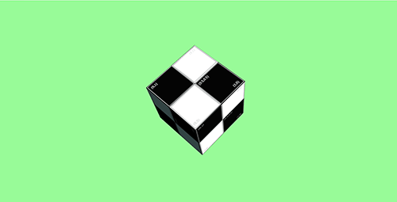
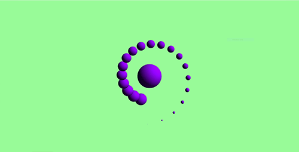
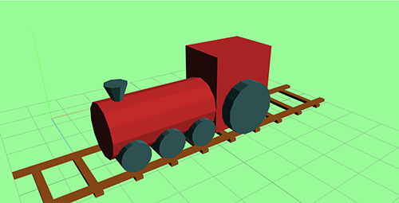
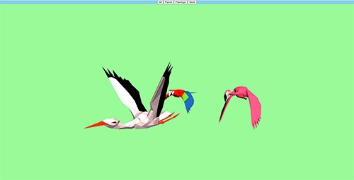

## threexperiments

Hands-on experiments, concepts and best practices dev notes on ThreeJS [r134](https://github.com/mrdoob/three.js/releases/tag/r134) from the [DISCOVER three.js](https://discoverthreejs.com/) site.

### Requirements

1. NodeJS 12.16.3
2. ThreeJS [r134](https://github.com/mrdoob/three.js/releases/tag/r134)

## Installation

1. Clone this repository.  
`git clone https://github.com/weaponsforge/threexperiments.git`

2. Install dependencies.  
`npm install`

## Usage

1. Run the app.  
`npm run dev`

2. Checkout the following branches for reference:
   - **dev** - basic ThreeJS setup  
`git checkout dev`  

   - **group-organize** - manage multiple meshes using the Group object  
`git checkout group`  

   - **toy-train** - use ThreeJS primitives to create a Mesh  
`git checkout toy-train`  

   - **load-models** - load pre-built `gltf` 3D models  
`git checkout load-models`  
   - **animation** - animate and add events on the loaded `gltf` 3D models  
`git checkout animation`  

3. Read the [wiki](https://github.com/weaponsforge/threexperiments/wiki) for more notes and information on ThreeJS.

## References

[[1]](https://discoverthreejs.com/) - discoverthreejs  
[[2]](https://threejs.org/manual/#en/fundamentals) - ThreeJS Fundamentals 

@weaponsforge  
20220131
